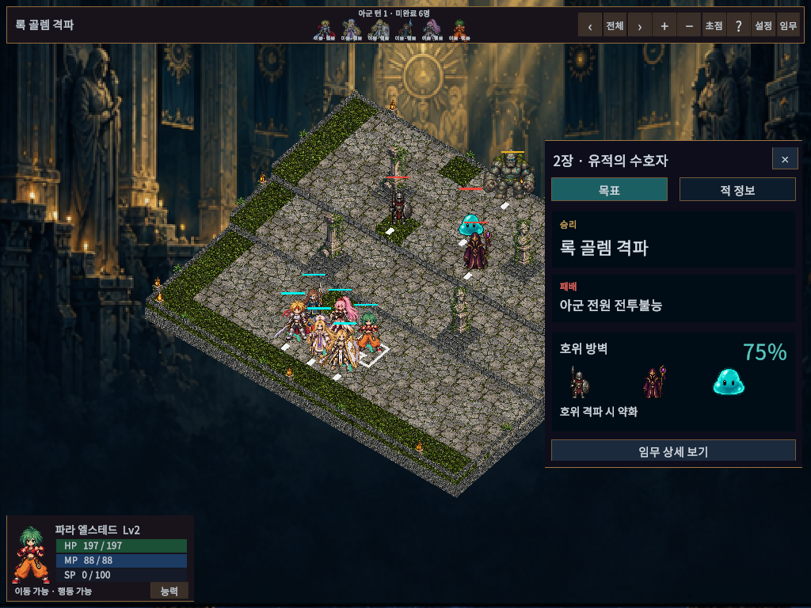
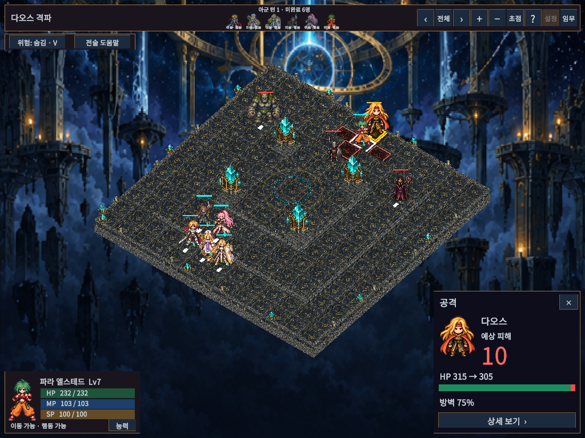
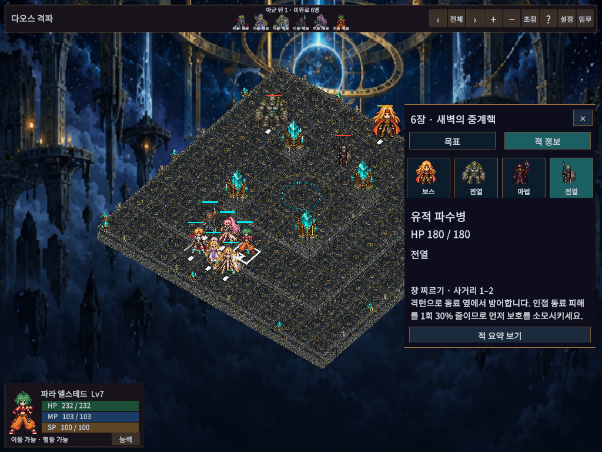

# 임무·전투 예측 정보량 정리

기존 전장·픽셀 캐릭터를 유지하면서 남색·청록·황동 색상으로 정보 패널을 정리했다. 생성형 시안 이미지가 아니라 Unity Game View의 실제 구현 화면을 아래에 보관한다.

## 조작

- 상단 임무: 오른쪽 목표/적 정보 탭. 기본 목표는 승리·패배·진행 상황 또는 호위 방벽만 표시한다. 지형·세부 조건은 임무 상세 보기에서 확인한다.
- 적 정보: 초상화를 선택해 해당 적의 체력·역할·예고를 조회한다. 적 상세 보기는 기본 기술과 대응 설명을 펼친다.
- 공격/기술 대상: 오른쪽 아래에 대상 그림, 큰 피해/회복 수치, HP 변화 막대, 필수 효과와 실제 발생하는 비용을 표시한다. 면역·전투불능·확률·상태 변화는 기본 카드에 남긴다.
- 범위 기술의 이전/다음 대상은 예측 카드만 전환한다. 실제 조준 위치·자원·행동 기록은 바뀌지 않는다. 상세 보기는 전체 대상의 계산 내용을 표시한다.
- 임무창이나 예측 상세창이 열리면 뒤의 명령/예측 카드를 숨긴다. 상단 중복 진행 설명과 상시 단축키 나열을 줄이고 전술 도움말로 모았다.

## 실제 화면

1024×768, 글자130%:

## 검증 범위

검수 도구 `Tools/ReviewCompactInformation.ps1`은 격리된 임시 저장과 메모리상의 캠페인을 사용한다. 5개 해상도, 글자100/130%, 임무2장/6장·적 상세·임무 상세·예측·전체 예측의 화면 조합에서 TMP 넘침과 화면 밖 버튼을 검사한다. Windows 일반 플레이어의 물리 입력·다른 PC/DPI·사람의 캠페인 완주 검증과 구분한다. 전체 결과와 빌드/실행 근거는 `Docs/VALIDATION.md`를 따른다.

최종 검증: 실제 Unity EditMode156/156(0.81초), PlayMode106/106(200.76초), 화면60조합 넘침/화면 밖 버튼0. Windows 일반 빌드20.080초·오류0/기존 경고7, 숨김 시작12초 유지·로그 오류0, 사용자 저장3파일 해시 불변. 실행본은 `Builds/WindowsCompactInformation/TalesTactics.exe`이며 폴더 전체가 필요하다. 초기 실패와 수정 근거도 VALIDATION.md에 기록했다.
