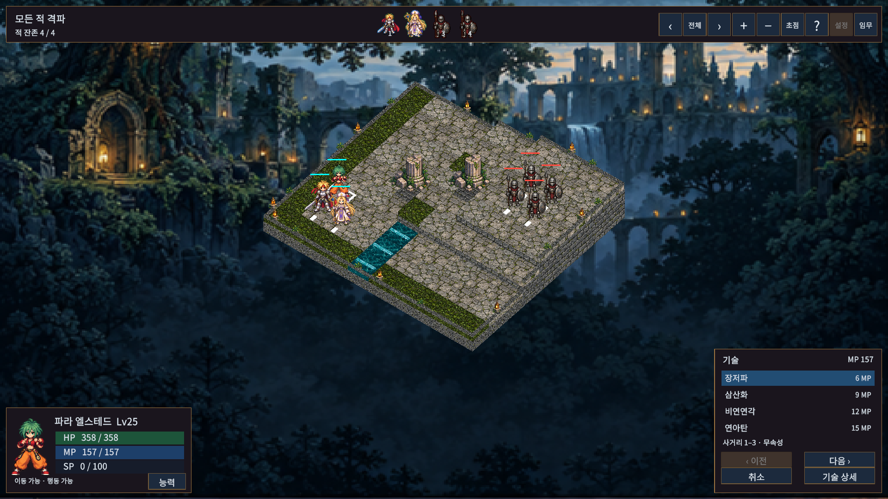
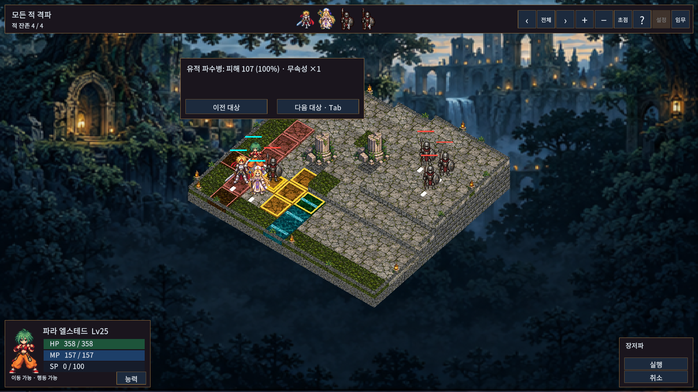

# 작은 기술 목록과 바로 대상 선택

기술 카드 대신 폭300의 작은 세로 목록에 기술명과 MP 비용을 표시한다. 한 페이지는 최대4행이며 기술 수에 맞춰 높이가 줄어든다. 여러 페이지일 때만 이전/다음 버튼을 표시한다. 마우스나 패드로 가리킨 기술의 사거리·속성을 한 줄로 보여주며 자세한 설명은 선택 사항이다.

기술을 누르면 곧바로 대상 선택으로 넘어간다. 중간 기술 정보 화면의 ‘목표 선택’ 버튼을 거치지 않는다. 실제 대상과 결과를 확인한 뒤 ‘실행’을 누르는 기존 절차는 유지한다. 취소하면 기술 목록으로 돌아오고 마지막 선택을 복원한다. 다른 기술 선택 시 이전 대상은 초기화한다.

현재 CanUse 판정을 통과한 기술만 표시한다. 미해금, MP/HP/게이지 부족, 재사용 대기, 연계 조건 미충족 등은 숨긴다. 사거리 내 대상의 유무는 별도의 대상 선택 단계에서 판정한다. 기술이 하나도 없으면 안내와 취소를 제공한다. 전투 수치와 저장 형식은 변경하지 않는다.

## 실제 화면

실제 Unity 전체 PlayMode78개 통과 후 목록 복귀 시 범위 표시 정리와 빈 목록 문구를 보완하고 관련9개를 재검증했다.5개 해상도의 목록/대상10개 상태는 aspect-matrix.json, 실제 포인터 클릭·취소·비용 유지 검사는 pointer-review.json 참조. 초기 검사2건은 이전 창 너비 기대값과 부동소수점 정확 비교 문제였으며 수정 후 통과했다.
