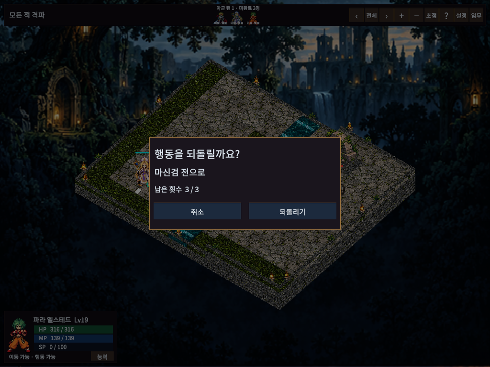
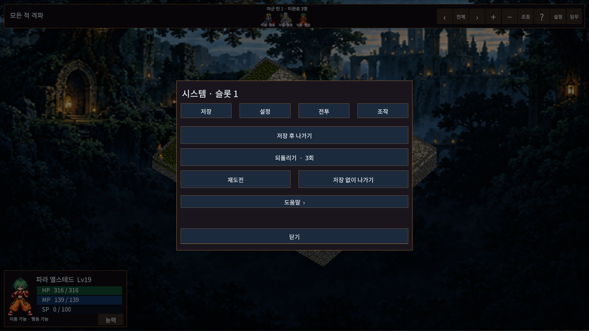
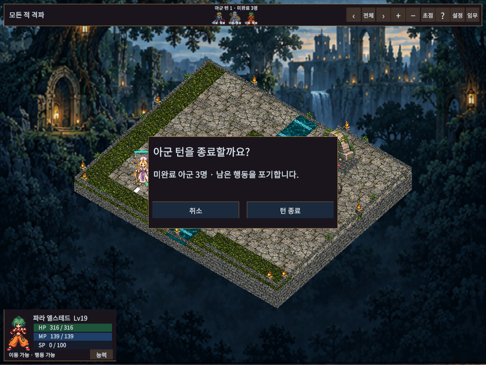

# 확인창·메뉴 문구 간결화

## 표시 원칙

기본 화면에는 선택에 필요한 정보만 표시한다. 상세 규칙은 사용자가 도움말을 열었을 때 보여 준다.

| 화면 | 기본 표시 |
| --- | --- |
| 되돌리기 | 질문, 되돌릴 행동, 남은 횟수, 취소/되돌리기 |
| 재도전 | 질문, 현재 전투 진행 초기화 안내, 취소/재도전 |
| 턴 종료 | 질문, 미완료 인원/남은 행동 포기, 취소/턴 종료 |
| 전투 메뉴 | 저장 후 나가기, 되돌리기 횟수, 재도전, 저장 없이 나가기 |
| 전투 설정 | 선택값과 다음 출전부터 적용 안내 |
| 패배 | 결과와 필요한 행동 버튼 |

되돌리기·재도전·턴 종료 창은 560×270 기준이며 시스템 탭과 중복 닫기 버튼을 넣지 않는다. 전투 메뉴도 640×460으로 줄였다. 큰 글자 설정은 유지한다.

저장·이어하기·되돌리기·재도전 규칙은 메뉴의 도움말로, 난이도·임무 변형·반격/지원 수치는 전투 설정의 규칙 보기로 이동했다. 설정 초안은 규칙을 조회하고 돌아와도 유지하고, 적용 없이 닫으면 취소한다. 기존 행동 버튼의 내부 이름과 클릭 연결을 유지했다. 전투 규칙과 저장 형식은 바꾸지 않았다.

## 실제 화면

## 검증

최종 결과와 범위는 [VALIDATION.md](../VALIDATION.md)의 2026-10-10 항목을 따른다.

- 실제 Unity PlayMode110/110, 최종 명령 목록 숨김 보완 후 관련2/2 통과. 실제 API DLL 참조4개 어셈블리 컴파일 통과.
- 9화면×3해상도(1024×768/1920×1080/2560×1080)×글자100/130%=54개 고유 조합에서 넘침0·화면 밖 버튼0.
- 도움말 왕복의 설정 초안 유지, 닫기 취소, 작은 확인창에서 메뉴/능력창 크기 복구, 취소 시 전투/캠페인 불변 확인.
- Windows 일반 빌드25.848초, 오류0/경고1(Pipeline 런타임 설정 미사용) 성공. 시작12초·로그 오류0, 일반 빌드의 검수 타입/Pipeline 서버 DLL 제외, 사용자 저장3파일 목록/SHA256 불변 확인.
- 최종 콘솔 오류0/경고0. Play 종료·Full HD·runInBackground=false·Scene dirty=false 복구. 시각 검증은 Editor Game View이며 다른PC/DPI·실물 입력장치 검수는 별도다.

실행본은 `Builds/WindowsConciseDialogs/TalesTactics.exe`이며 폴더 전체가 필요하다. 공개 릴리즈/main 반영은 하지 않는다.
