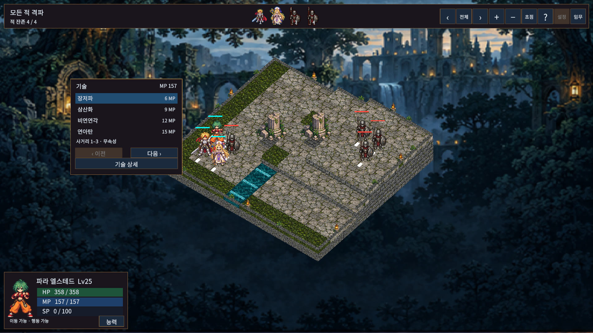
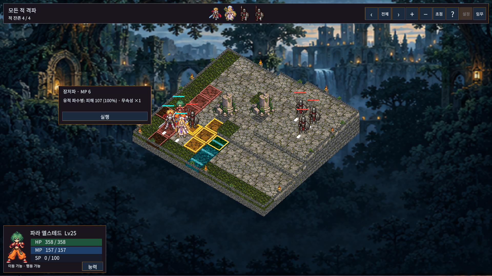

# 캐릭터 옆 기술창과 바깥 클릭 취소

기술 목록과 대상 확인/실행 창을 행동 중인 캐릭터 옆에 배치한다. 카메라·화면 변화에 맞춰 위치를 갱신하고 유닛 및 화면 경계를 피한다. 대상 정보와 실행을 하나의 작은 창으로 합쳤으며 이전/다음 대상 버튼과 별도 대상 패널을 제거했다. Tab/Shift+Tab 및 패드 트리거 대상 전환은 유지한다.

컨텍스트 메뉴 바깥의 빈 곳을 클릭하면 한 단계 취소한다. 대상 선택은 기술 목록으로, 기술 목록·이동 선택·방향 선택은 행동 메뉴로 돌아간다. 이동 직후 행동 메뉴에서는 취소 가능한 이동만 원래 위치로 되돌린다. 하위 메뉴 취소와 이동 되돌리기를 한 클릭으로 함께 실행하지 않는다.

유효한 대상이나 이동 가능한 칸 클릭은 선택이 우선이다. 다른 UI를 클릭하거나 모달·이야기·행동 연출·전투 결과가 열려 있을 때는 바깥 클릭 취소를 실행하지 않는다. 마우스와 패드 커서가 동일한 경로를 사용한다. Esc/우클릭/B 취소와 기존 이동 취소 명령도 유지한다.

다수 대상 피해 미리보기는 두 명까지 표시하고 나머지 인원 수를 덧붙인다. 피해·비용·사거리 규칙과 저장 형식은 바꾸지 않았다.

## 실제 게임 화면

검증: 실제 Unity 전체 PlayMode81/81, 최종 위치 보완 후 관련3/3 통과. 신규 검사는 바깥 클릭/이동 되돌리기/유효 칸 우선/모달 보호/실제 마우스 이벤트/Tab 전환/카메라 회전 시 창 추적을 포함한다. 상세 기록은 상위 VALIDATION.md를 따른다.
