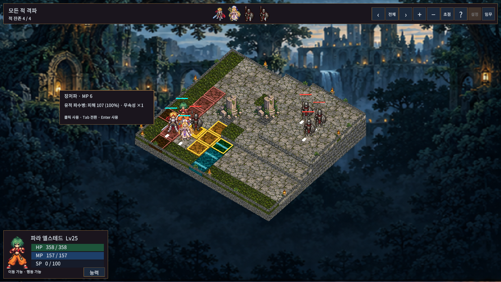

# 대상 클릭 즉시 사용

기술 선택 후 유효한 대상을 클릭하면 즉시 발동한다. 기존 ‘실행’ 버튼은 제거했다. 마우스를 대상 위로 움직이면 비용을 쓰지 않고 피해/회복 미리보기를 표시한다. Tab/Shift+Tab은 미리보기 대상 전환, Enter/숫자패드 Enter는 선택한 대상에 사용한다.

빈 곳 클릭 취소와 모달 입력 보호는 유지한다. 행동 연출 중 반복 클릭·확인 입력은 추가 행동이나 비용 차감을 만들지 않는다. 프로그램 검수용 SelectTarget/State.Tile는 미리보기 경로로 유지하고 실제 마우스·패드 커서 전장 클릭은 HandleBattleClick에서 확정한다.

검증 결과는 상위 VALIDATION.md를 따른다.

