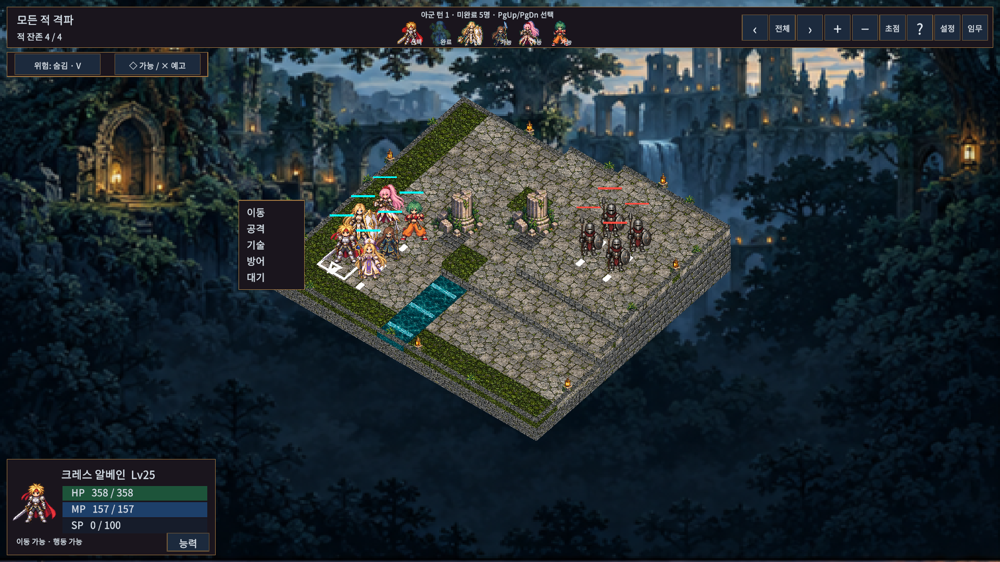

# 아군 턴 자유 선택

기본 전투를 **아군 전체 → 적군 전체** 방식으로 바꿨습니다. 아군 턴의 명령 대기 상태에서 맵의 아군이나 상단 캐릭터를 클릭하거나 PgUp/PgDn으로 미완료 아군을 선택합니다.

- 선택을 바꿔도 이동·공격 사용 여부, 이동 취소, MP, 쿨다운, 연계와 상태 지속은 유지합니다.
- ‘대기’ 또는 ‘방어’ 후 방향을 확정하면 해당 아군이 완료됩니다. 상단의 완료 표시는 회색이며 다시 선택할 수 없습니다. 전원 완료하면 적군이 한 번씩 행동하고 다음 아군 턴이 시작됩니다.
- 기술 대상 선택·연출·방향 선택·모달 중에는 선택을 바꾸지 않습니다. 취소해 명령 화면으로 돌아오면 다시 고를 수 있습니다.
- 기절·수면인 아군을 선택하면 기존 행동 불가 처리를 한 번 수행합니다. 이미 종료했거나 페이즈 시작 때 전투불능이던 아군은 부활해도 그 페이즈에 추가 행동하지 않습니다.
- 전투 규칙에서 기존 SPD 라운드/CT도 선택할 수 있습니다. 기존 설정의 CT 선택 및 V1/V2 중단 전투는 해당 규칙을 유지합니다. 자유 선택 전투는 V3 중단 기록으로 현재 선택과 각 아군의 진행을 복원합니다.
- 생존 임무는 기존과 같이 **아군 개별 턴 종료 12회**를 셉니다. 캐릭터 선택만 바꾸는 동작은 횟수를 늘리지 않습니다.

## 검증

Unity 6000.6.0f1 실제 전체 PlayMode **97/97(192.82초)**, 최종 EditMode **133/133(0.98초)**, 부활/저장 보완 후 관련 PlayMode **4/4(5.55초)** 통과. 자유 선택·이동 취소·행동 중복 방지·기절·적군 페이즈·중단/재실행·기존 SPD/CT 이어하기를 포함합니다. Runtime/Editor/EditMode/PlayMode의 실제 Unity API DLL 컴파일도 통과했습니다. ManagedChecks는 실행하지 않았습니다.

`Tools/ReviewFreeTurns.ps1`로 1024×768,1280×800,1366×768,1920×1080,2560×1080과 글자100/130%의 **10조합**을 확인했습니다. 모두 아군 버튼6개, 미완료 선택 가능5개, 활성 버튼 화면 이탈0·문구 넘침0·상단 버튼 겹침0입니다. 프레임3306→13648 진행 및 대표 스크린샷을 기록했습니다. 한 명 완료 상태와 새 선택 상태를 별도 임시 저장으로 재현했습니다.

Windows 실행 파일은 `Builds/WindowsFreeTurns/TalesTactics.exe`이며 같은 폴더의 데이터/DLL 전체가 필요합니다. 공개 preview.2에는 이번 변경이 포함되지 않습니다.

시각 검증은 Editor Game View입니다. Windows 일반 플레이어의 물리 입력, 실제 게임패드, 다른 PC/DPI 및 새 턴 규칙으로 사람이 6장을 완주한 난이도 평가는 이번 범위에 포함하지 않습니다.

Windows 일반 빌드 **10.415초·오류0·기존 경고4** 성공. 12초 숨김 시작 검사에서 프로세스 유지·로그 오류/예외0건을 확인했습니다. 사용자 저장3개 SHA256은 전후 불변이며, Play 종료·Full HD·runInBackground=false·Scene dirty=false로 복구했습니다. `windows-build.json`, `startup-check.json`, `user-save-check.json`, `editor-restored.json`을 참고하세요.
