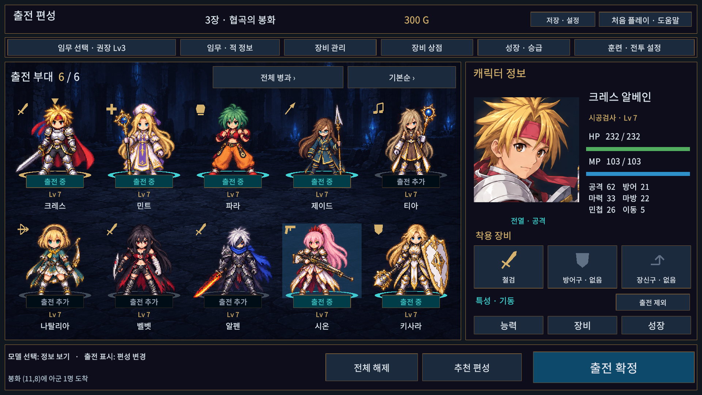

# 전신 모델 출전 편성

승인된 2안의 짙은 남색·황동·청록 시안을 기존 uGUI 준비 화면에 적용했다. 별도 프로젝트나 전투 시스템을 만들지 않는다.

## 조작

- 왼쪽 5×2 전신 모델을 선택하면 오른쪽 초상화·직업·레벨·능력치·장비·특성을 확인한다. 정보 조회는 출전 편성 및 성장 기록을 변경하지 않는다.
- 모델 아래 `출전 중 / 출전 추가` 또는 상세창의 출전 버튼으로 편성을 바꾼다. 금색 고리는 현재 살펴보는 인원, 청록색 고리와 문구는 출전 인원을 뜻한다. 출전 인원은 Rules.MaxDeployment를 지키고, 0명이면 출전 확정을 비활성화한다.
- 병과 필터는 전체 → 근접 → 원거리 → 마법·지원 → 출전 인원을 순환한다. 정렬은 기본 → 레벨 내림차순 → 이름순이다. 정렬·필터는 원본 카탈로그 순서나 편성을 바꾸지 않으며 빈 결과도 안내한다. 10명 초과 카탈로그는 페이지를 제공한다.
- 전체 해제·추천 편성·출전 확정을 하단에 고정했다. 추천 편성은 기존 균형 6인 규칙을 사용한다.
- 능력은 상세 모달, 장비 슬롯은 해당 슬롯의 교체 화면, 장비·성장은 선택 캐릭터의 기존 관리 화면으로 연결한다. 표시 수치는 저장된 성장·장비·특성을 적용한 실제 미리보기이며 훈련에서는 Lv25 규칙을 사용한다.
- 임무 선택에서 장 목록·잠금·최초/반복 보상·이야기를 확인한 뒤 출전 준비로 돌아온다. 상단의 임무 정보·장비 관리·상점·성장·훈련 설정·저장·도움말도 유지한다.
- 기존 마우스, Tab/Shift+Tab와 Enter, 게임패드 화면 커서·선택 경로를 사용한다.

## 아트와 구조

전투 모델은 기존 픽셀 스프라이트를 사용한다. 새 초상화와 유적 배경의 경로·생성 프롬프트는 [ART.md](ART.md)에 기록했다. 모델의 짧은 이름은 목록에서만 쓰고 상세창에는 전체 이름을 표시한다. 장비 아이콘은 기존 벡터 도형이며 실제 장비명/미장착 여부를 표시한다. 시안의 예시 수치·장비를 실제 저장에 주입하지 않는다.

`BattleModelDeploymentHud`는 BattleHud의 준비 화면 렌더러를 확장한다. Canvas의 Expand 정책과 앵커를 사용하며 기존 장비·성장·전투 화면은 기존 배치를 유지한다. `FormationRing`은 작은 해상도 독립 UI 메시다. 초상화 아틀라스는 고정 캐릭터 ID로 선택하므로 필터/정렬로 다른 인물의 그림이 표시되지 않는다. 캐릭터 Content, Scene, 저장 형식, 전투 판정은 변경하지 않는다.

## 검수 재현

Unity Test Runner의 PlayMode 전체 검사를 실행한다. 새 `ModelFormationTests`는 실제 UI Submit과 포인터 Raycast를 사용해 조회/편성 분리, 인원 제한, 빈 목록, 정렬 뒤 인물 일치, 장비·특성 반영, 모달 차단, 관리 화면 복귀와 실제 출전을 검사한다.

`Tools/ReviewModelFormation.ps1`은 열린 TestBattle의 Play Mode에서 실행한다. 임시 저장 경로와 메모리 안의 Lv7/3장/장비 값을 사용하고 사용자 저장에는 기록하지 않는다. 1024×768, 1280×800, 1366×768, 1920×1080, 2560×1080에서 글자 크기100/130%를 측정하고 실제 Game View를 캡처한다. 실행 뒤 Play Mode 종료와 Game View 크기·runInBackground 복구가 필요하다. 도구가 만든 Assets/Docs/ModelFormation 캡처는 검수 후 Assets 밖으로 옮긴다.

## 2026-10-08 검증 결과

- 실제 Unity 전체 PlayMode **90/90 (184.15초)** 통과. 최종 모델 발 위치·이름 높이·비활성 색상 보정 뒤 편성 관련 **3/3 (4.04초)** 재통과. 새 포인터/Submit 경로와 기존 캠페인·상점·장비·성장·입문·전투 회귀를 포함한다. `playmode-results.json`, `final-formation-tests.json`.
- 첫88/90의 실패는 이전 준비창 높이 기대와 조회 시 성장 기록 추가였다. 새 모델 패널 기준으로 검사하고 표시 전용 기본 성장값을 사용하도록 고쳤다. 빈 저장의 조회 불변 검사도 추가했다. `playmode-initial.json`은 수정 전 기록이다.
- 최종 5해상도×글자100/130% **10조합**에서 각40개 활성 버튼의 화면 이탈0건·활성 문구 넘침0건. Game View 프레임2293→18539 진행을 기록하고 1024/1920/2560 대표 PNG를 직접 검수했다. 1280×800에서 발견한 모델 이름 높이는 고정 하단 영역으로 수정했다. `aspect-matrix.json`과 PNG.
- 실제 Unity API DLL 기반 Runtime/Editor/EditMode/PlayMode C# 컴파일 통과. `api-check.log`. EditMode125개는 이전 시스템·UI 작업의 통과 기록이며 이번 UI 변경에서는 다시 실행하지 않았다. ManagedChecks도 실행하지 않았다.
- Windows 일반 빌드 **30.078초, 오류0/경고10** 성공. 기존 Pipeline 설정·개발 전처리기·런타임 필드 직렬화·셰이더/TMP 경고다. 12초 숨김 실행에서 프로세스 유지와 로그 예외/오류0건. `windows-build.json`, `startup-check.json`, `windows-startup.log`, `build-hashes.json`.
- 사용자 campaign.json/.bak/.v1.bak SHA256 불변이며 설정/추가 슬롯을 생성하지 않았다. 검수는 임시 저장 경로를 사용했다. Play 종료·runInBackground=false·Full HD·Scene dirty=false로 복구하고 캡처 에셋/동적 폰트 캐시/기존 자동 검사 CSV의 임시 변경을 정리했다. `user-save-check.json`, `editor-restored.json`.

최신 실행 파일: **`Builds/WindowsModelFormation/TalesTactics.exe`**. 같은 폴더의 데이터와 DLL이 함께 필요하다. 이 변경은 현재 개발 브랜치에 반영하며 공개 preview.2 릴리즈는 그대로다.

시각 검수는 Editor Game View이며 Windows 일반 플레이어는 시작 로그 검사다. 물리 게임패드, 다른 PC/DPI, 사람의 전 캠페인 완주와 원작 외형 감수는 이 UI 변경의 자동 검증에 포함하지 않는다.
