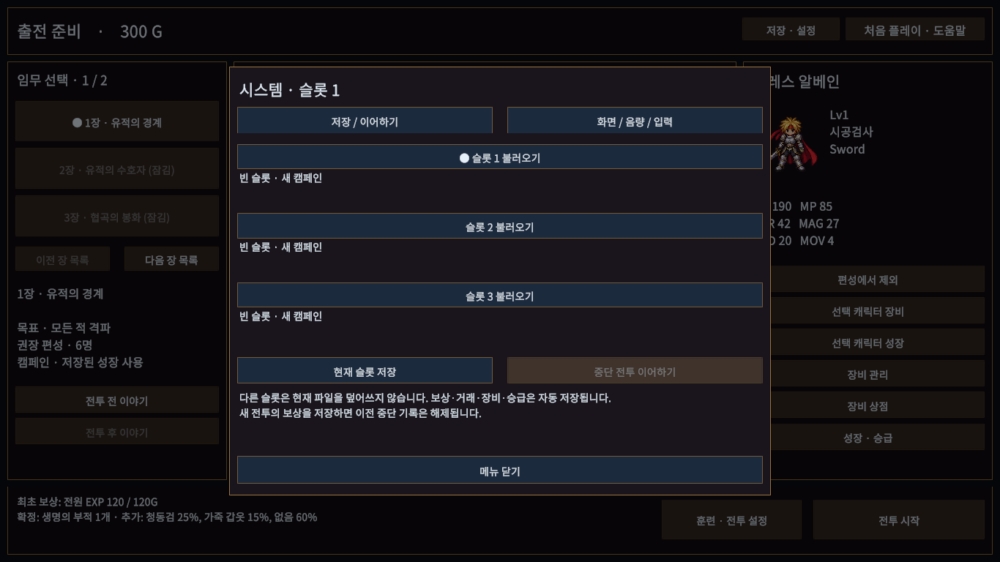
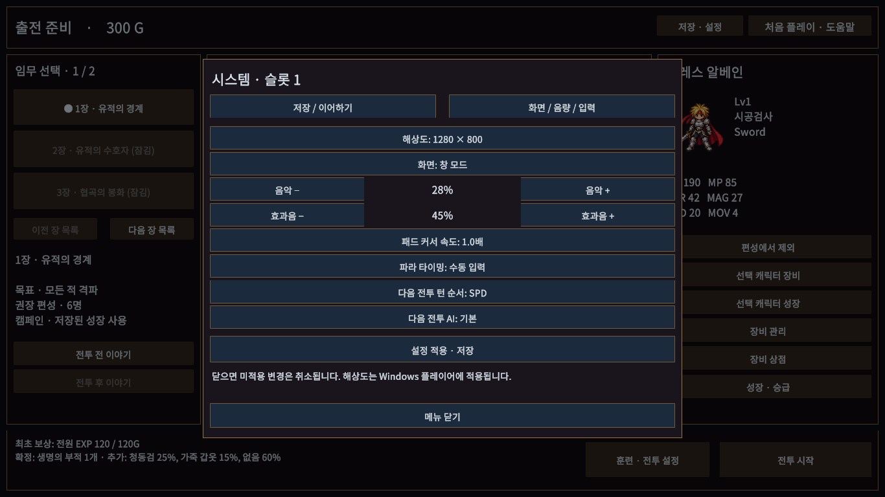
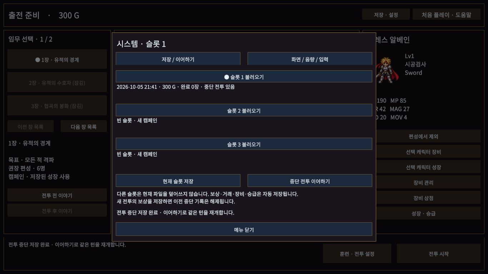

# 저장·이어하기·설정

판매 준비 개선안 4번. 준비 화면 상단 **저장 · 설정**, 전투 상단 **메뉴 · F5**에서 연다. 닫기/Esc/우클릭/패드B로 돌아가면 선택 상태가 유지된다. 적 턴·연출·이야기 중에는 열지 않는다.

## 저장 슬롯

슬롯은 세 개이며 슬롯1은 기존 `campaign.json`을 그대로 사용한다. 슬롯2/3은 별도 파일이다. 슬롯을 불러오는 동작은 다른 슬롯을 덮어쓰지 않는다. 빈 슬롯은 새 캠페인으로 시작한다. 현재 슬롯 저장으로 준비 중 편성과 선택 장을 보존한다. 보상·거래·장비·승급의 기존 자동 저장을 유지하며 성공 시 슬롯/시각을 표시한다. 마지막 선택 슬롯은 설정에 기록한다.

기존 V1→V2 이관과 .bak 복구·손상 원본 보존·미지원 새 버전 보호를 유지한다. V2에 선택 장/편성/저장 시각/중단 기록을 추가했다. 이 필드가 없는 기존 V2 파일도 읽는다. 미래 중단 기록 버전은 캠페인 저장을 차단해 원본을 보호한다.

## 전투 중단

캠페인 아군의 명령 대기에서 **전투 중단 · 저장 후 준비로**를 선택한다. 행동 연출/적 턴/훈련/입문 연습/결과/보상 재시도 중에는 중단할 수 없다. 실제 위치, HP/MP/SP, 레벨/장비, 방향, 이동/행동/취소 여부, 상태/쿨다운/고유 행동 플래그, SPD 대기열 또는 CT 누적값, 난수 상태를 저장한다.

준비 화면의 **중단 전투 이어하기**로 같은 명령 단계에 돌아온다. 검증과 저장이 성공한 뒤에만 전장에 진입한다. 이어하기는 중단 기록을 한 번 소비한다. 재개 후 다시 종료하려면 중단 저장해야 한다. 운영체제 종료/강제 종료 시 임의 프레임을 자동 복원하는 기능은 아니다. 새 전투 보상이나 장비/상점/승급 저장은 기존 중단 기록을 해제한다. 실패 시 진행 중인 전투를 유지하고 실패 안내를 표시한다.

## 설정

별도 `settings.json`에 창/전체화면, 1280×800·1366×768·1920×1080 해상도, 음악/효과음 음량, 패드 커서 속도, 파라 자동 타이밍, 기본 SPD/CT 및 AI를 저장한다. **설정 적용 · 저장**을 누르기 전 초안은 닫으면 취소한다. 화면 설정은 Windows 플레이어에 적용한다. 현재 전투의 턴 스케줄러/AI는 변경하지 않고 다음 전투부터 적용한다. 훈련 모드/목표는 실행 중 선택으로 유지한다.

검증 결과·빌드와 한계는 ../VALIDATION.md를 따른다.

실제 Unity Game View 1366×768에서 확인했다. 개발 플레이어 별도 프로세스 검수는 `Tools/RunPersistenceReview.ps1`을 사용한다. 이 검수의 저장/설정은 PersistentDataPath/PersistenceReviews/GUID 아래에만 작성한다.
