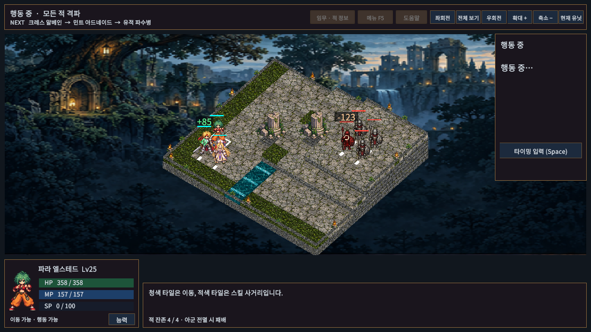
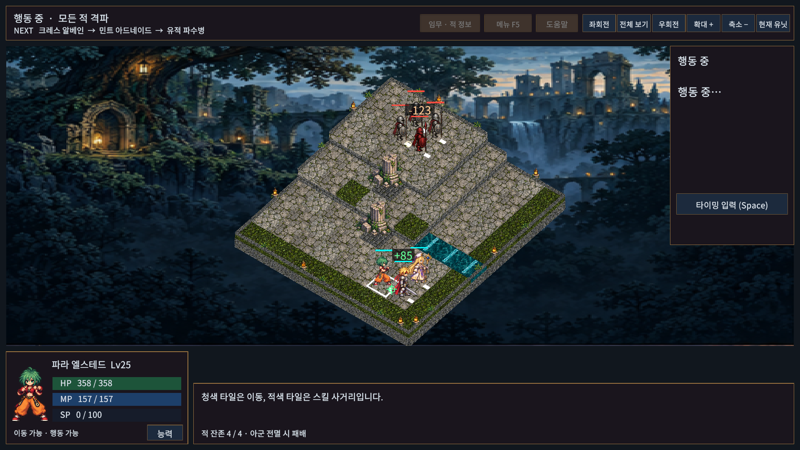

# 8번 — 전투 피드백·효과음 보강

기존 캐릭터/맵 아트를 유지하며 전투 중 읽기 쉬운 표시와 효과음 중첩 처리를 보강한다. 신규 원화·음원 제작이나 전문가 청음 승인을 뜻하지 않는다.

- 피해·회복·HP 비용 숫자의 크기를 키우고 반투명 어두운 배경을 붙였다. 첫0.38초는 선명하게 유지한 뒤0.65초까지 사라진다. 회복은 +기호/녹색, 피해는 -기호, 비용은 HP 접두어로 구분한다.
- 카메라를 돌리는 동안에도 숫자가 머리 위를 유지한다. 배경은 숫자와 함께 제거하며 공유 머티리얼을 수정하지 않는다.
- 같은 효과음의45ms 이내 중복 요청을 합치고 동시 재생을4개로 제한한다. 새 재생의 게인은 동시 개수에 따라1/√n으로 낮춘다. 이는 중첩 완화이며 오디오 마스터 리미터나 최대 출력 피크 보장이 아니다.
- 효과음 수명은 실제 시간 기준이라 적 배속/시간 배율과 분리된다. 음소거 상태에서는 새 음성을 예약하지 않고 StopAll에서 추적 정보까지 초기화한다. 음악/궁극기 테마의 소스·복귀 위치는 기존 경로를 유지한다.

## 확인 범위

실제 Unity EditMode102/102, 최종 PlayMode71/71 통과. 새2개 검사는 효과음 중복/상한/음소거/정지/실제 시간 만료와 숫자 대비/회전/HP 불변/재출전 정리를 확인한다. 기존14곡 재생과 궁극기 테마 복귀 검사도 전체 검사에 포함된다. Windows 일반 빌드는 오류0/경고8, 개발 빌드는 오류0/경고10으로 성공했다.

새 개발 플레이어에서1~6장과 재실행7회가 모두 통과했다. 기존 저장/설정 불변·실행 로그 오류0건을 확인했다(save-and-log-check.json). 캠페인 결과는 ../PlayerReviews/512cb66074294c8cbd2aada5c4f96f9f-summary.json. 이번 완료 범위는 전투 표시/효과음 동시 재생 보강이며8번 최종 작화·청음 평가 전체 완료는 아니다.

피해·회복을 구성한 격리 훈련 장면에서 실제 Game View를 확인한다. 캡처를 위해 표시 중 시간을 멈춘 시각 검수이며 자연 전투 완주나 표시 지속 시간 측정 증거는 아니다. 지속 시간/카메라 회전/정리는 PlayMode 검사로 검증한다. 실제 빌드·캠페인 결과는 VALIDATION.md와 이 폴더의 보고서를 따른다.

사람의6장 균형 평가, 전문 작화 감수, 스피커/헤드폰별 청음은 남아 있다. 사용자1장 테스트 기록은 ../BalancePlaytest/user-test-summary.json에 별도로 기록했다.
