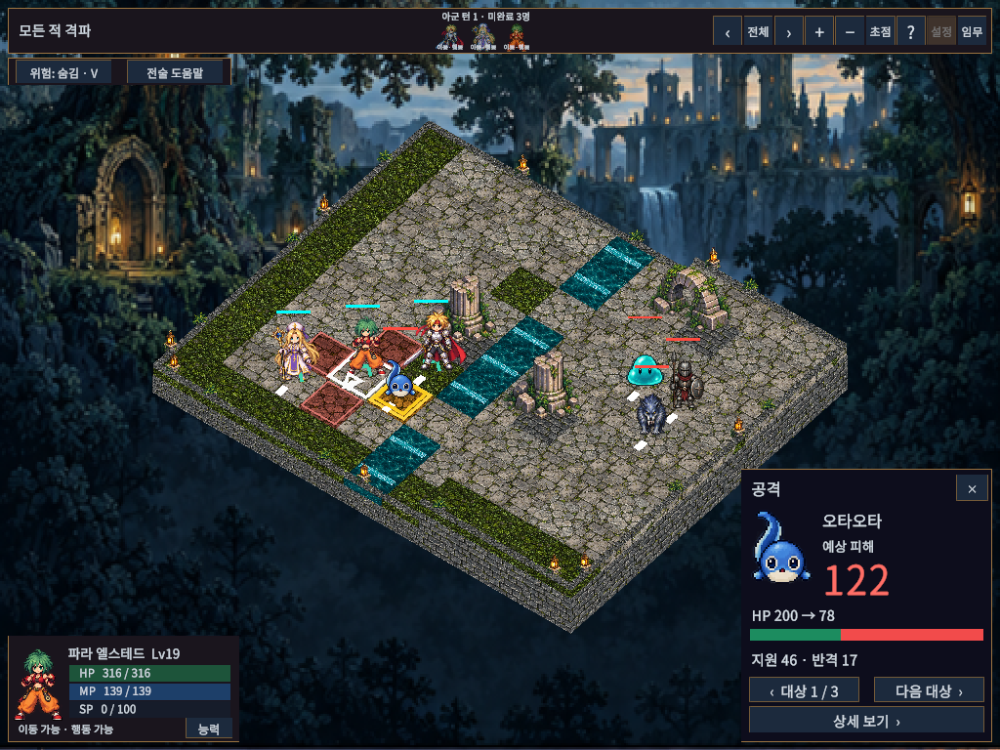
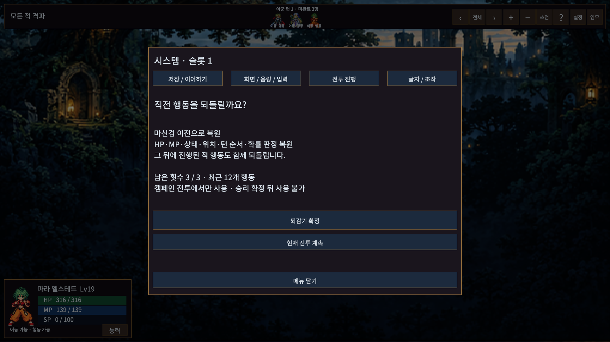
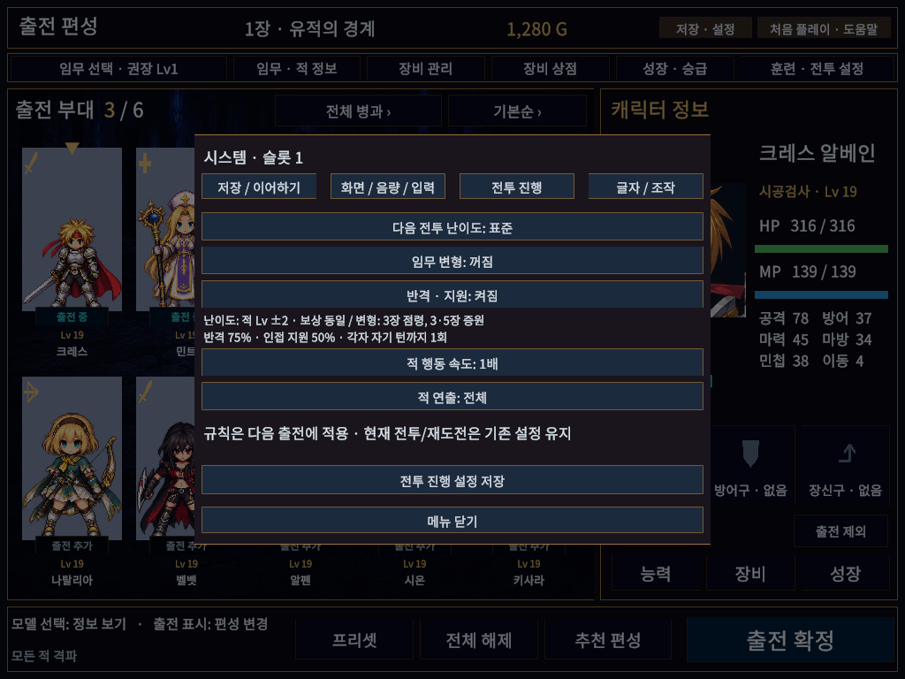

# 반격·지원 공격과 행동 되감기

## 조작

저장·설정 → 전투 진행의 **반격 · 지원**을 켜고 저장한 다음 출전한다. 기본값은 꺼짐이다. 진행 중인 전투·이어하기·시작 상태 재도전은 출전 당시 규칙을 유지한다.

- 단일 대상의 확정 피해 공격 뒤 **지원 → 반격** 순서로 처리한다. 범위/직선/부채꼴 공격, 회복과 확률 피해만 있는 기술에는 붙지 않는다.
- 지원자는 공격자 또는 대상에 인접한 같은 팀 유닛 중, 대상이 자신의 기본 공격 사거리/시야/높이 조건 안에 있는 첫 유닛이다. 편성/배치 목록 순서로 정하며 아군·적군에 동일하게 적용한다.
- 지원 피해는 기본 공격 피해의50%, 반격은75%다. 각 유닛은 자기 턴 시작까지 지원1회와 반격1회를 사용할 수 있다. 기절·수면·전투불능 유닛은 참여하지 않는다. 지원으로 대상이 쓰러지면 반격하지 않는다.
- 추가 공격은 기본 공격의 피해 효과만 사용한다. 정상 행동/MP/게이지/쿨다운/연계를 소비하거나 생성하지 않고 다른 추가 공격을 유발하지 않는다. 보호·방벽·방향·속성·자동 부활은 기존 판정을 사용한다.
- 예측 카드에 지원/반격 수치를 요약하고 대상별 최종HP에 합산한다. 전체 예측에는 사용한 반응도 표시한다. 확률 상태 효과는 기존처럼 제외 가정임을 표시한다. 실제 연출은 본 공격→지원→반격 순서로 표시한다.

캠페인 전투에서 **메뉴 F5 → 행동 되감기 → 되감기 확정**으로 직전 행동 전으로 돌아간다. 패배 화면에도 버튼이 있다.

- 전투당3회, 최근12개 행동 기록. 이동·이동 취소·공격/기술·방어·대기·아군 턴 일괄 종료를 기록한다. 기술 취소나 단순 유닛 조회는 기록하지 않는다.
- HP/MP/상태/방향/위치/턴 큐/자원/쿨다운/지원·반격 소모/점령·증원/전투 난수 진행을 복원한다. 해당 행동 뒤에 진행된 적 행동도 되돌린다.
- 공격 후 되감으면 그 공격 이전으로 돌아간다. 앞서 이동했다면 그 이동은 남아 있다. 이동까지 되돌리려면 한 번 더 사용한다.
- 아군 명령 대기 또는 패배 때 사용하며 연출/적 행동/튜토리얼 중에는 잠긴다. 훈련에는 제공하지 않는다. 승리 보상 확정 뒤에는 사용할 수 없다. 저장된 성장·장비·골드는 변경하지 않는다.
- 되감기 사용 횟수와 기록은 중단 저장/이어하기에도 남는다. 출전 당시 재도전은 새 전투로 시작해3회를 다시 제공한다.

## 저장과 구현

중단 기록 V8, 시작 기록 V3. 기존 V1–V7 중단/V1–V2 시작 기록은 읽으며 반격·지원은 비활성으로 복구한다. 이전 실행본은 V8 기록을 읽을 수 없으므로 되돌릴 때는 업데이트 전 백업이 필요하다.

SkillResolver의 실제 처리와 BattleProjection이 같은 반응 규칙을 사용한다. System.Random은 기존 알고리즘을 유지하고 사용 횟수를 기록해 되감기/이어하기에서 같은 상태로 복구한다. 예측은 실전 난수를 소비하지 않는다. 되감기 프레임은 내부 중첩 기록을 포함하지 않는 체크포인트 JSON으로 저장하며 개수/크기/규칙 일치와 상태를 검증한다.

## 검증과 한계

실제 Unity EditMode174/174, 전체 PlayMode110/110, 최종 반격/능력창 관련1/1을 통과했다. 실제 Unity API DLL 참조4개 어셈블리 컴파일도 통과했다. ManagedChecks는 실행하지 않았다.

설정·전투 예측·메뉴·되감기 확인·패배·능력창을 5해상도(1024×768/1280×800/1366×768/1920×1080/2560×1080)와 글자100/130%로 검수했다. `aspect-matrix.json`의60개 고유 조합 모두 TMP 넘침0/화면 밖 활성 버튼0이다. 보완 후 다시 검사한 행은 기존 행을 교체했으며 중복 합산하지 않았다. 대표 작은 화면/Full HD PNG를 직접 확인했다.

최종 실제 결과와 실패 후 수정 내용은 [검증 기록](../VALIDATION.md)의 이번 항목을 따른다. 사람의 체감 밸런스·실물 패드·다른PC/DPI 검수는 별도다. 지원자 직접 지정과 여러 단계 반응 연쇄는 제공하지 않는다. 기존 AI의 단일 행동 휴리스틱을 유지하므로 장기적인 반격 교환을 최적화하는 AI는 아니다.

Windows 실행본은 `Builds/WindowsReactionsRewind/TalesTactics.exe`이며 폴더 전체가 필요하다. 개발 빌드32.543초/일반 빌드35.809초, 각각 오류0/기존 외부 패키지 안내3건으로 성공했다. 개발 플레이어4회 독립 실행으로 SPD/CT 저장·이어하기를 통과했다(`persistence/`는 격리된 합성 데이터). 일반 실행본의 시작12초·로그 오류0, 검수 코드3타입 및 Pipeline 서버 DLL 제외를 확인했다. 사용자 저장3파일 목록과 SHA256은 불변이다.

최종 콘솔 오류0/경고0을 확인하고 Play 종료·Full HD·runInBackground=false·Scene dirty=false로 복구했다. 빌드 안내3건(Pipeline 런타임 비활성, URP 내부 디버그 셰이더 제외2건)은 빌드 보고서에 보존했다. 공개 릴리즈/main 반영은 하지 않는다.

## 실제 화면

