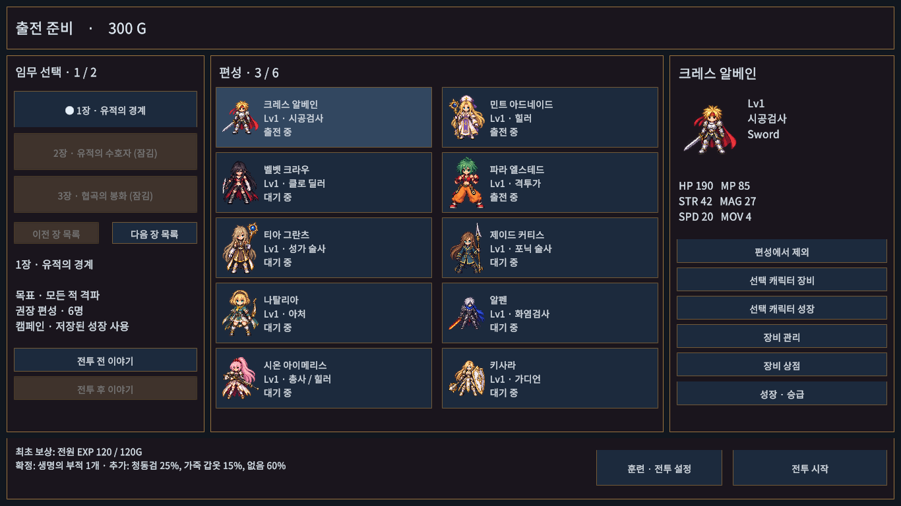
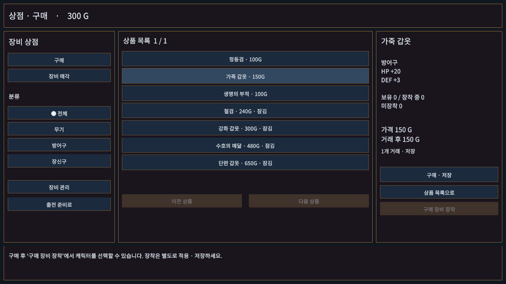
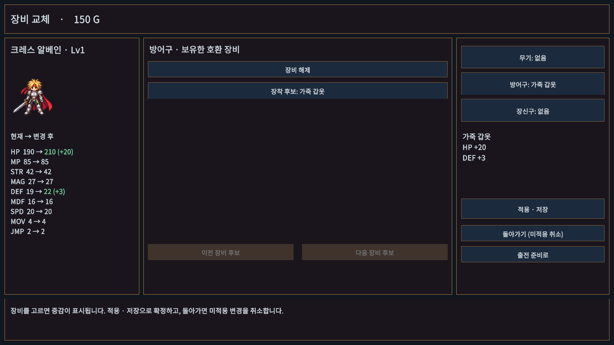
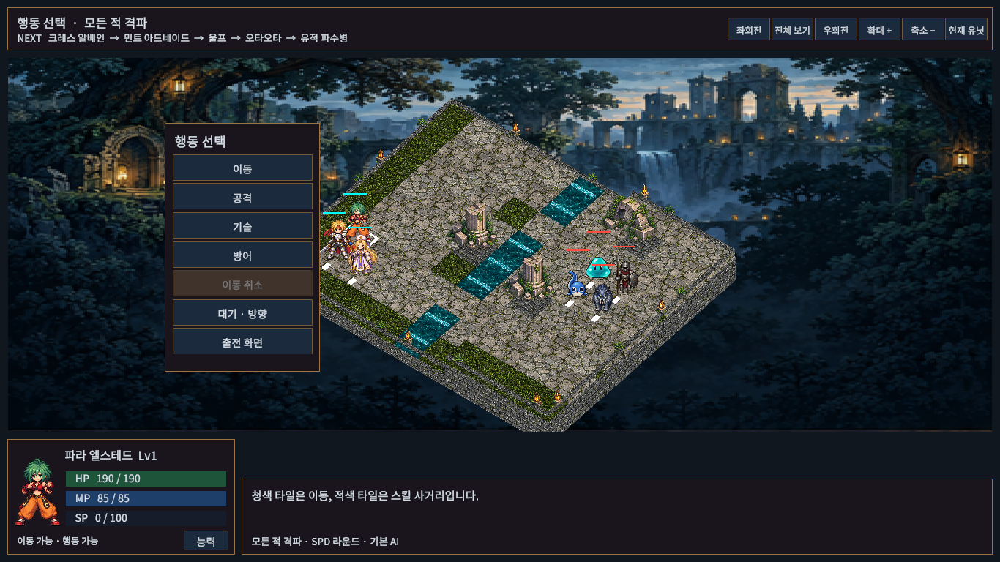
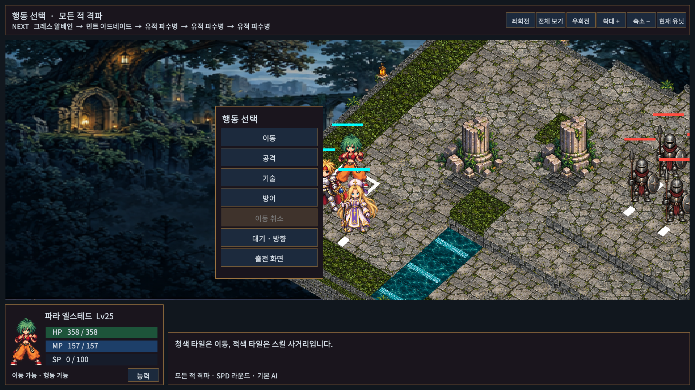

# 전장 가독성·출전 준비 UI 개선

판매 준비 개선안 중 1번 전장 가독성과 2번 편성·장비·상점 동선 범위다. 스토리 확장이나 전체 출시 준비 완료를 뜻하지 않는다.

- 전체 카메라는 각 타일의 투영 경계를 사용한다. 상단의 현재 유닛 버튼은 행동자와 선택 대상을 확대하고, 전체 보기/Home은 기본 회전과 전체 지도 구도로 복귀한다.
- 행동자 흰 테두리, 대상 금색 테두리, 이동 목적지 청록 테두리를 사용한다. 대상 선택은 이전/다음 버튼, Tab/Shift+Tab, 패드 LT/RT로 순환한다. 유효 대상만 선택하며 실행은 별도 확정한다.
- 출전 준비는 좌측 장 선택, 중앙 10인 초상화 카드, 우측 선택 캐릭터 정보와 편성 조작, 하단 고정 출전 버튼으로 구성한다. 카드 선택만으로 편성 인원이 바뀌지 않는다.
- 장비는 슬롯을 선택하고 보유한 호환 후보를 직접 고른다. 현재/변경 후 능력치를 색상과 증감 숫자로 비교하며 적용·저장 전에는 원본을 바꾸지 않는다.
- 상점은 구매/매각·종류 필터·페이지 목록·선택 장비 상세를 함께 표시한다. 거래 후 분류와 페이지를 유지하며 구매 직후 호환 캐릭터의 장비 비교 화면으로 이동할 수 있다.
- 훈련/전투 규칙은 별도 설정 화면으로 옮겼다. 기존 저장 보호, 실패 시 거래/장비 롤백, 장착 중 수량 보호와 캠페인 해금 규칙을 재사용한다.

## 조작

편성 카드를 선택한 뒤 우측에서 출전 추가/제외를 누른다. 장비 화면에서는 슬롯 → 중앙 후보 → 적용·저장 순서로 확정한다. 상점의 구매 장비 장착은 장착 비교 화면으로 이동하는 버튼이며 구매만으로 자동 장착하지 않는다.

## 검증

Unity EditMode 95/95, PlayMode 58/58 통과. 카메라 6장×4회전·집중 보기/복귀·재출전, 편성 검사/변경 분리, 구매→장비 비교→저장, 대상 순환/모달 입력 보호를 새로 검사했다. 첫 PlayMode 실행에서 발견한 전투 종료 시 카메라의 null 참조와 빈 매각 목록 안내를 수정했다. 컴파일 복구 중 테스트 도구의 0개 결과는 통과 증거에 포함하지 않았으며 스크립트 재로드 후 58개를 실제 실행했다.

최종 빌드·플레이어 검증 수치와 한계는 [검증 기록](../VALIDATION.md)의 이 작업 기록을 따른다. 스크린샷은 실제 Unity Game View이며, 자동 캠페인 검사는 사람이 전 장을 수동 완주하거나 실물 패드로 검수한 결과가 아니다. Game View 1920×1080·1366×768에서 확인했고 세로 화면의 전체 수동 검수는 하지 않았다.

