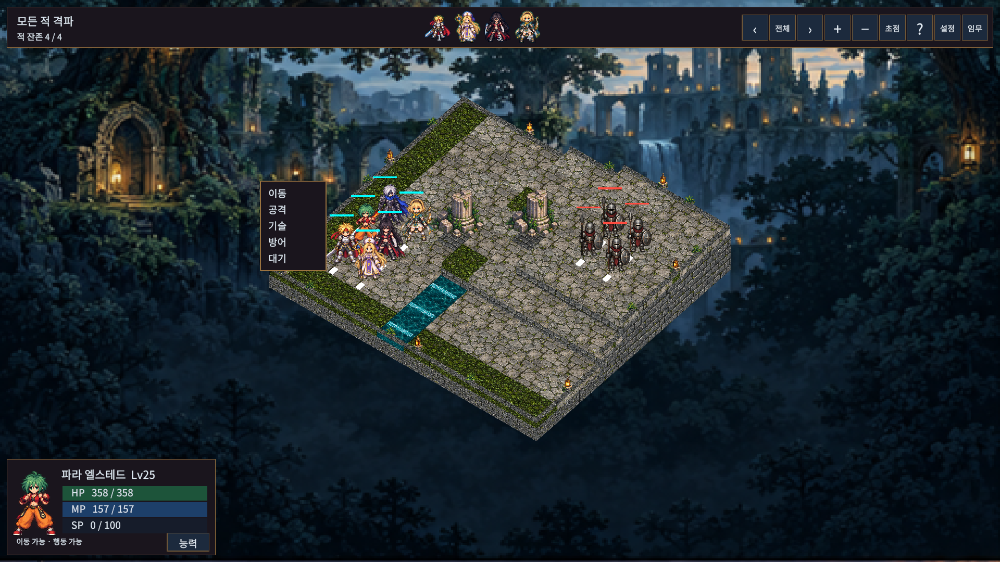
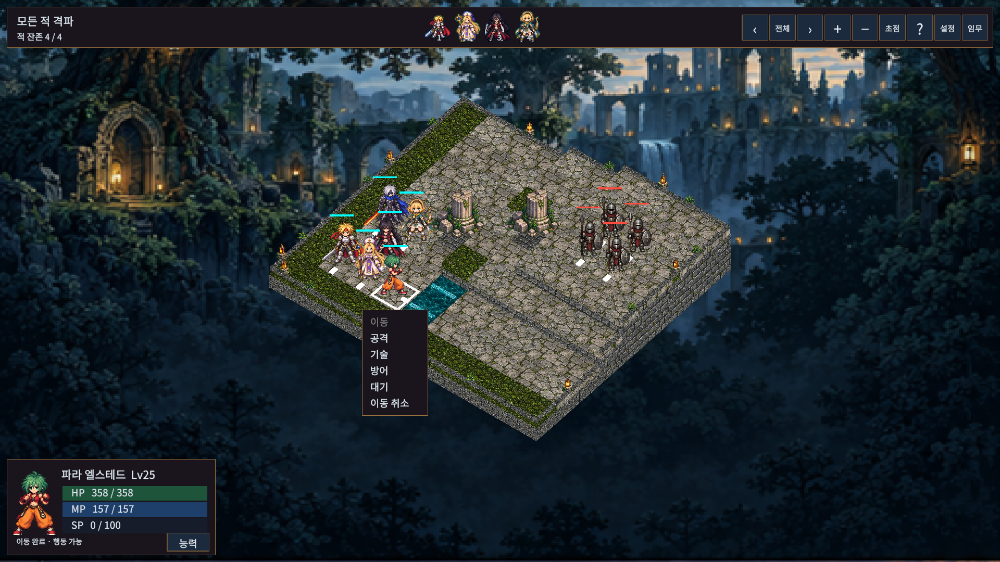
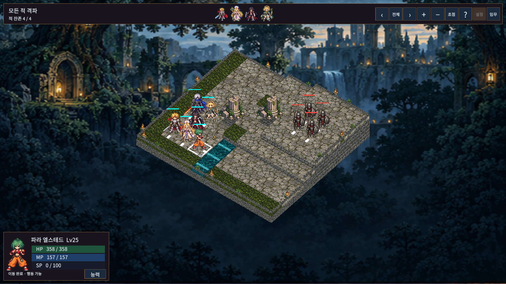

# 간결한 명령 메뉴와 방향 선택

명령창을 유닛 옆의 이동·공격·기술·방어·대기 5줄로 축소했다. 기본 크기는 논리 좌표104×142이며 이동 취소가 가능할 때만 여섯 번째 줄을 표시한다. 출전 준비 복귀는 상단 메뉴에서 선택한다. 이동 안내와 공격 실행/취소 창도 축소했다.

대기를 선택하면 캐릭터 주위에 작은 상하좌우 꺾쇠 화살표가 나타난다. 화살표를 클릭하면 해당 방향을 바라보며 턴을 종료한다. 현재 방향은 금색으로 표시한다. 화살표 그래픽 영역은20×20, 투명 클릭 영역은40×40이다. 카메라를 회전해도 화면 방향에 맞춰 재배치한다.

이동 경로는 같은 편 유닛이 서 있는 칸을 통과할 수 있다. 도착 칸은 비어 있어야 하며 적, 벽, 고저차, 이동 비용, 이동 불가 상태는 기존 규칙을 따른다. 이동 취소와 밀치기/끌어당기기의 점유 보호도 유지한다.

기존 기술 카드·캐릭터 요약·능력 상세 창·저장·캠페인 콘텐츠를 유지했다. 검증 결과와 실제 화면은 상위 VALIDATION.md의 이번 변경 기록을 따른다.

## 실제 게임 화면

해상도별 측정은 aspect-matrix.json에25개 상태를 기록했다. 위 facing-final 화면은 실제 이동 → 명령 → 대기 흐름으로 촬영했다.

검증: 실제 Unity EditMode109/109·PlayMode77/77,5개 해상도25개 상태, Windows 빌드와1~6장/재실행7회 통과. 일반 빌드의 기존 경고8개와 검수 한계는 VALIDATION.md 참조. 최신 일반 실행 파일은 `Builds/WindowsSimpleHud/TalesTactics.exe`이며 해당 폴더 전체가 필요하다.
