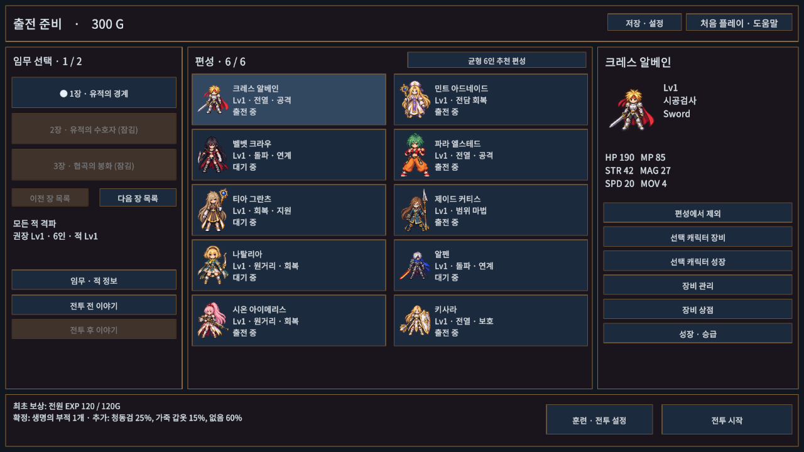
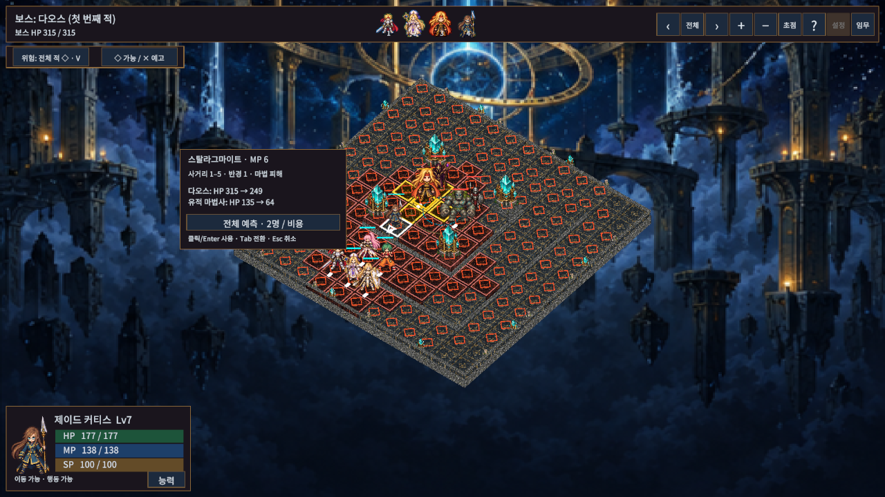
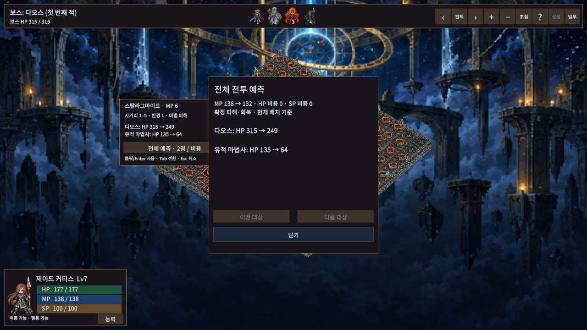
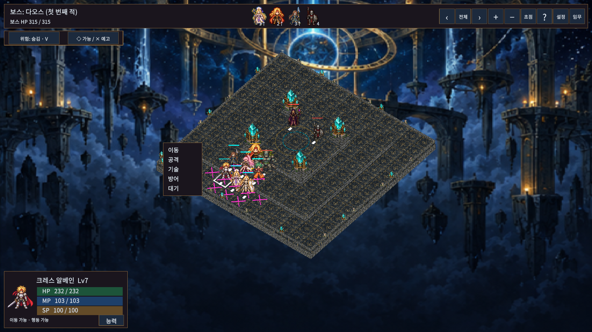
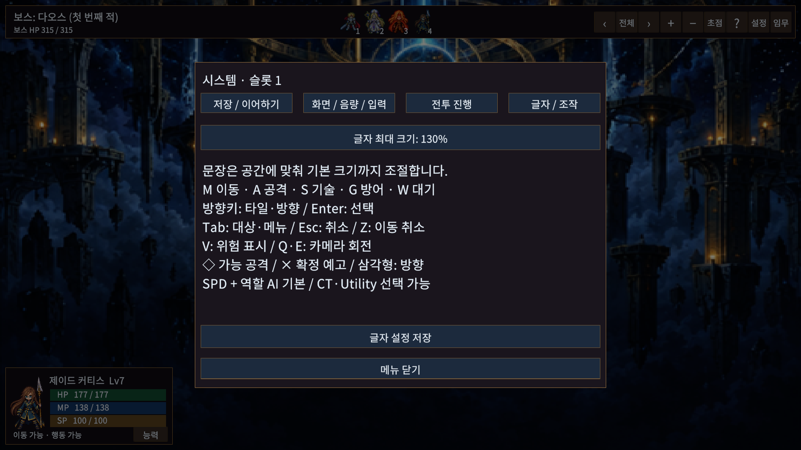

# 시스템·UI 개선

기존 6장 캠페인과 작은 캐릭터 옆 명령창을 확장했다. 대상 클릭은 즉시 사용, 마우스 호버·Tab·방향키는 미리보기다. 기존 에셋을 재생성하지 않고 전술 기술 4개와 장신구 3개를 추가했다.

## 캠페인과 성장

| 장 | 승리 조건 |
|---|---|
| 1 | 모든 적 격파 |
| 2 | 첫 수호자 격파 |
| 3 | 봉화 (11,8)에 아군 1명 도착 |
| 4 | 살아 있는 아군의 턴 종료 12회 |
| 5 | 첫 출전 아군을 수문 (12,8)까지 호위. 해당 아군 KO 시 패배 |
| 6 | 다오스 격파 |

도착·호위·생존은 적 전멸만으로 승리하지 않는다. 보상·해금·이야기는 기존 저장 흐름을 사용한다. 중단 전투 V2는 생존 진행, 특성, 보호 사용, 궁극기 체험, 적의 예고를 보존한다. 이전 V1 중단 전투는 기존 전멸 목표로 이어진다.

신규 슬롯 기본 편성은 크레스·민트·키사라·제이드·시온·파라다. 기존 저장 편성은 유지한다. 준비 화면에서 역할과 권장 레벨을 보고 추천 편성을 다시 적용할 수 있다. 성장 화면의 합류 훈련은 해금한 장의 진입 레벨보다 뒤처진 동료만 올린다. 저장 실패 시 성장·특성을 복원한다.

기존 EXP 곡선, Lv20 승급, Lv50 상한은 유지한다. 1장 완료 시 Lv7 이하, 2장 완료 시 Lv13 이하, 4장 완료 시 Lv19 이하 일반 기술을 캠페인에서 사용할 수 있다. 6장은 게이지 100으로 시작하고 레벨 미달 궁극기를 캐릭터마다 한 번 체험할 수 있다. MP·HP·게이지·고유 연계 조건은 여전히 필요하다.

## 역할과 선택

전열 적은 격턴으로 동료 옆에서 방어하고, 마법형은 회복 또는 범위 공격을 준비한다. 돌격형은 예고한 위치를 향해 이동·공격한다. 보스는 예고 → 위치를 고정한 공격 → 휴식 순서다. 예고 뒤 목표가 이동해도 추적하지 않는다. 공격 뒤 빈틈에는 받는 피해가 25% 증가한다. 기절·수면은 준비를 중단시킨다.

SPD와 역할 기술 AI가 기본이다. CT는 행동 빈도를 바꾸고, Utility 옵션은 역할 기술 외에 해금한 고유 기술까지 비교한다. 훈련의 기존 목표·Utility 선택은 유지한다.

| 특성 | 이점 | 비용 |
|---|---|---|
| 균형 | 기본 능력 유지 | 없음 |
| 기동 | MOV +1 | DEF -15% |
| 호위 | 방어 중 인접 동료 피해 30% 감소 | MOV -1 |
| 집중 | MP 비용 -20% | MOV -1 |
| 치유 | 회복량 +25% | STR -15% |

호위는 자기 턴마다 한 번이며 한 피해에 여러 보호자가 중첩되지 않는다. 보호자는 살아 있고 방어 중이어야 하며 기절·수면 중에는 보호하지 못한다. 준비 화면에서 특성을 무료 변경할 수 있다.

1장 이후 상점에 기동 장화(MOV +1 / DEF -3), 집중 부적(MP 비용 -15% / MOV -1), 치유 휘장(회복 +20% / SPD -2)을 추가했다. 각각 180G다. 특성과 장비 배율은 곱해서 적용하며 MP는 마지막에 올림한다. 장비 비교는 특성까지 반영한다.

## 전투 정보와 조작

- V 또는 위험 버튼: 숨김 → 선택 적 → 전체 적. ◇는 현재 MP·배치에서 이동 후 기술이 닿을 수 있는 범위이며 실제 AI 선택의 확정 표시는 아니다. 이동 목적지에는 위험한 적 수와 색을 표시한다.
- ×는 예고한 고정 공격 위치다. 일반 위험 표시를 꺼도 보인다. 아군을 이동시켜 피하거나 시전을 중단시킬 수 있다.
- 공격 예측은 HP 전후, KO, 실제 회복 상한, MP·HP·SP 비용, 상태 지속과 확률을 보여 준다. 전체 예측창은 모든 대상을 3명씩 넘겨 볼 수 있다. 확률 효과는 제외한 HP 가정을 명시한다.
- 예측은 별도 전투 복제본에서 계산하며 실제 위치·점유·자원·상태·난수를 바꾸지 않는다.
- 행동 유닛 사각형, 선택 유닛 마름모, 방향 삼각형을 구분한다. 턴 순서 초상화에 커서를 올리면 전장 유닛이 강조되고 클릭하면 상세가 열린다. 순서 변동에는 화살표를 표시한다.
- M 이동 / A 공격 / S 기술 / G 방어 / W 대기 / Z 이동 취소. 방향키는 타일·대기 방향, Enter는 선택, Tab은 대상·메뉴 순환이다. Esc·우클릭은 한 단계 취소한다.
- 이동 뒤 행동하면 이동 취소가 잠긴다. 공격 후 새로 한 이동은 취소할 수 있다. 이동 후 다른 유닛을 클릭하면 이동을 유지하면서 정보를 확인한다.
- 설정의 글자 최대 크기는 100/115/130%다. 좁은 칸에서는 기본 크기까지 줄여 잘림을 피한다. 게임패드 가상 커서도 호버 예측을 사용한다.

## 검증

실제 Unity EditMode **125/125**, PlayMode **87/87**를 통과했다. 별도 API 컴파일도 런타임·에디터·두 테스트 어셈블리에서 통과했다. 결과는 editmode.json, playmode.json, api-check.log다. ManagedChecks는 이번에 재실행하지 않았다.

Game View 1024×768 / 1280×800 / 1366×768 / 1920×1080 / 2560×1080에서 기술 목록과 대상 예측의 10개 조합을 확인했다. 활성 버튼의 화면 경계 이탈은 0건이다(aspect-matrix.json). 대표 3개 해상도 PNG를 직접 확인했으며 130% 글자 설정과 실제 EnemyTurn으로 발생한 다오스 예고를 추가 확인했다. 별도 저장 경로와 준비한 6장 전투 배치를 사용했다. 모든 장·모든 팝업의 조합을 검사한 것은 아니다.

최신 결과·실행 파일·검증 한계는 [VALIDATION.md](../VALIDATION.md)를 따른다. 사용자 저장과 분리한 프로필로 실행한다. 실제 연결된 입력 장치는 키보드와 마우스이며, 물리 게임패드 기기별 검수는 수행하지 않았다.

Windows 일반/개발 빌드 모두 성공했고 개발 플레이어의 7회 독립 실행으로 1~6장 승리, 재실행·정상 패배·재출전·보상/저장을 확인했다([요약](../PlayerReviews/d1ec10ec56e940158c198e2a33b66327-summary.json)). 일반 빌드는 142초 동안 정상 유지되고 시작 로그 예외가 없었다. Computer Use의 실제 Windows 창 캡처는 검게 나오고 활성화 재시도도 실패해, 위의 시각 증거는 Editor Game View로 한정한다. 최신 실행 파일은 `Builds/WindowsSystemUi/TalesTactics.exe`다.

