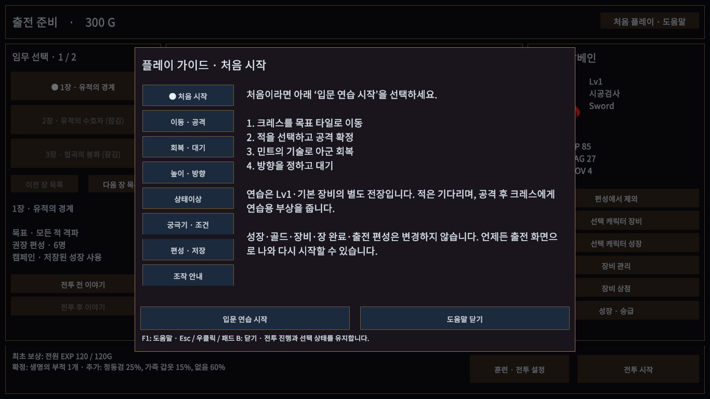
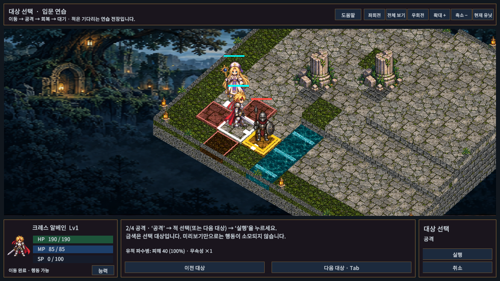
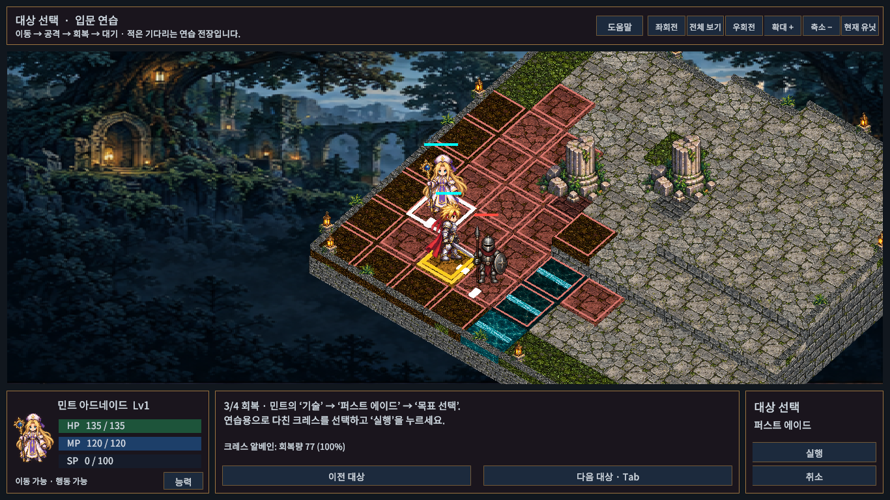
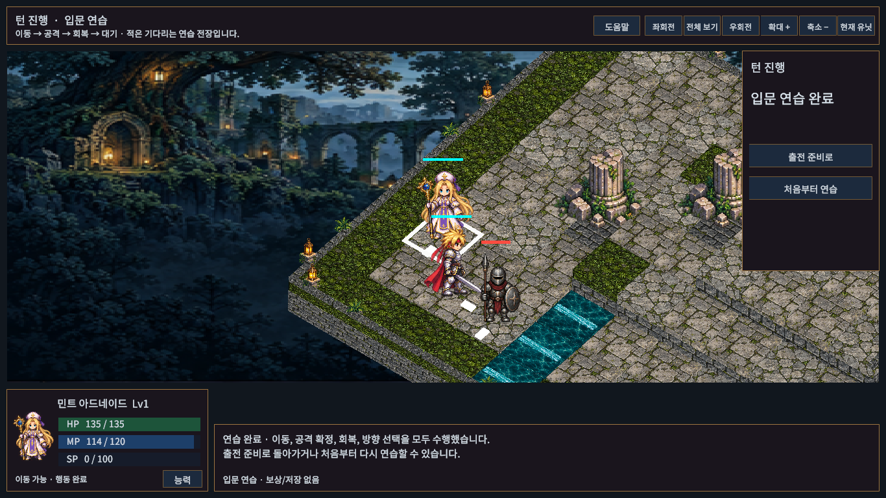

# 입문 연습과 게임 내 도움말

판매 준비 개선안 3번. 출전 준비 상단 **처음 플레이 · 도움말** → **입문 연습 시작**으로 들어간다. 전투 중에는 상단 도움말 또는 F1로 가이드를 연다. 연출 중·적 턴·이야기 중에는 전투가 진행되는 동안 설명 창을 띄우지 않는다.

## 직접 수행하는 네 단계

1. 크레스의 이동을 선택하고 하나뿐인 푸른 목표 타일을 누른다.
2. 공격 → 적 또는 다음 대상 → 미리보기 → 실행으로 공격한다.
3. 민트의 기술 → 퍼스트 에이드 → 목표 선택 → 다친 크레스 → 실행으로 회복한다.
4. 대기 · 방향 → 바라볼 방향을 선택해 연습을 마친다.

단계별로 필요한 명령만 활성화하며 취소는 현재 단계를 유지한다. 공격 연습 후 크레스에게 명시적인 연습용 부상을 준다. 적은 기다린다. 이동/사거리/공격 비용/피해/회복은 기존 GridMap·SkillResolver·연출 경로를 사용하며 버튼을 누르기만 하고 판정을 생략하지 않는다.

연습 전장은 Lv1·장비 없는 크레스와 민트로 구성한다. 사용자의 출전 인원, 훈련/CT/AI 설정, 선택 장, 성장, 장비, 골드, 장 완료 기록과 저장 파일은 변경하지 않는다. 중단하거나 완료해도 보상이 없으며 출전 화면에서 다시 시작할 수 있다. 완료 화면에는 처음부터 연습 버튼도 있다. 연습 진행도는 저장하지 않는다.

## 도움말

처음 시작 / 이동·공격 / 회복·대기 / 높이·방향 / 상태이상 / 궁극기·조건 / 편성·저장 / 조작 안내의 8개 페이지다. 높이·방향 배율과 궁극기 Lv/MP/SP 조건은 현재 카탈로그를 읽는다. 궁극기의 추가 고유 조건은 기존 기술 상세에서 확인한다.

도움말 동안 준비 화면의 중앙 카드까지 포함해 배경 메뉴·전장·카메라 입력을 차단한다. 닫기, F1, Esc, 우클릭, 패드 B로 닫으면 기존 선택/전투 상태를 유지한다. 전투 중간 상태가 저장되지 않는 현재 제한도 도움말에 명시했다.

## 검증 범위

최종 결과와 실행 파일 위치는 [검증 기록](../VALIDATION.md)을 따른다. 자동 테스트·실제 화면 확인은 초보 사용자의 외부 플레이테스트를 대신하지 않는다. 설명 없이 처음 접한 사람이 쉽게 배웠는지에 대한 체감 검증은 별도다.

## 실제 화면 (1366×768 Game View)

실제 버튼 콜백과 타일 선택으로 이동·공격·퍼스트 에이드·방향 선택을 순서대로 실행했다. 크레스 HP145→190, 민트 MP120→114를 확인했다. 궁극기 10명 조건 페이지와 한국어 방향 버튼도 확인했다. 네이티브 Windows 마우스 클릭 또는 초보자의 학습성 시험으로 표현하지 않는다.
