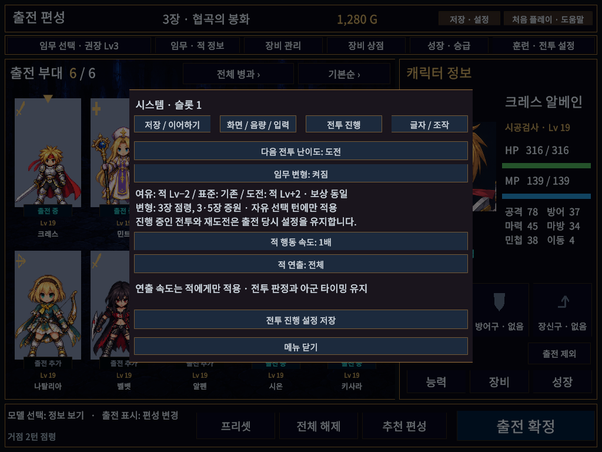
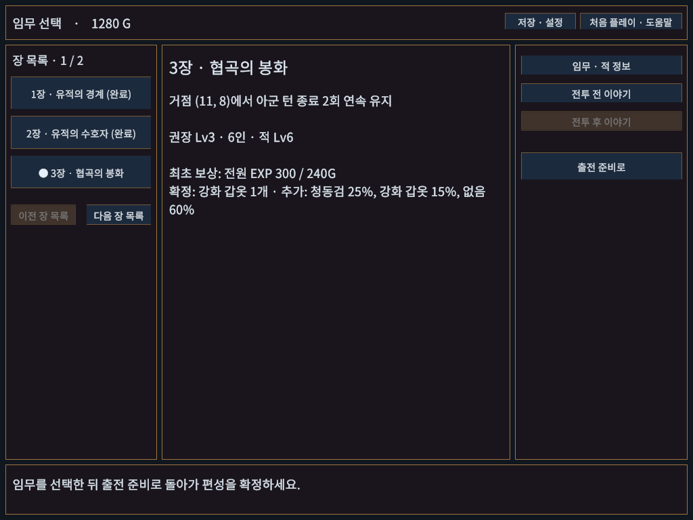
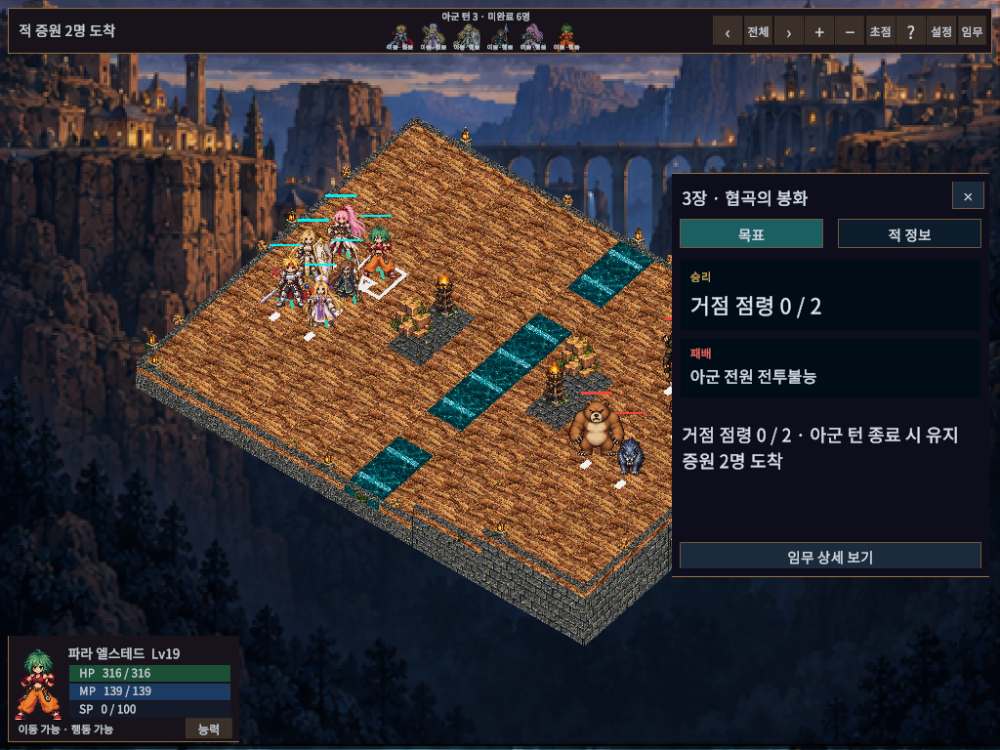

# 경고 정리와 선택형 임무 규칙

## 사용 방법

저장·설정 → 전투 진행에서 다음 전투 난이도와 임무 변형을 선택하고 저장한다. 닫기만 하면 미적용 변경은 취소된다.

- **표준**: 기존 적 레벨. 기본값이다.
- **여유 / 도전**: 적 시작 레벨 −2 / +2, 최소1·최대50. 아군 성장과 클리어 EXP·골드·장비 보상은 동일하다.
- **임무 변형**: 기본 꺼짐. 캠페인의 아군 자유 선택 턴에만 적용한다. 훈련과 SPD/CT 전투는 기존 임무를 유지한다.
- **3장 점령**: 목표 봉화에 아군이 있는 상태로 아군 전체 페이즈를2회 연속 끝내면 승리한다. 비어 있는 상태로 아군 페이즈를 끝내면 진행이0으로 돌아간다. 같은 아군이 계속 서 있을 필요는 없다.
- **3·5장 증원**: 3번째 아군 턴 시작에 적2명이 등장한다. 기존 적 출발 지점 가까이의 비어 있는 이동 가능 칸을 사용하며, 공간이 부족하면 보류한다. 등장 직후 아군이 먼저 대응할 수 있고 다음 적군 페이즈에 행동한다.

설정 변경은 다음 출전에 적용한다. 현재 전투, 이어하기, 시작 상태 재도전은 출전 당시 조건을 유지한다. 임무 선택 화면의 목표·적 레벨, 임무창의 상세 조건·증원 예고도 선택한 옵션을 반영한다.

## 저장 호환

중단 전투 V7에 난이도·변형·점령 진행·증원 여부를 저장한다. V1–V6 중단 기록은 기존 표준 규칙으로 읽고, 시작 기록 V1도 계속 읽는다. 새 시작 기록 V2는 옵션을 보존한다. V7 중단 기록은 이전 실행본에서 읽지 못하므로 이전 버전으로 돌아갈 때는 업데이트 전 백업이 필요하다. 캠페인 성장·골드 데이터의 버전은 기존 V2를 유지한다.

## 경고 처리

- CS0618: 구형 정렬 인자 없는 객체 검색으로 교체했다. 기존 호출은 모두 None이었으므로 정렬에 의존하지 않는다.
- UAC0009: 검수 코드의 DEVELOPMENT_BUILD 분기를 UNITY_EDITOR/DEBUG로 변경했다. [Unity6000.6의 기호 설명](https://docs.unity3d.com/6000.6/Documentation/Manual/scripting-symbol-reference.html)을 확인했다.
- UAC1001: Target/InspectedUnit/HoveredUnit은 임시 전투 상태이므로 NonSerialized를 명시했다. 실제 저장은 기존 체크포인트 경로를 유지한다.
- TMP 셰이더 2개의 구형 enable_d3d11_debug_symbols 지시문 3곳을 현재 enable_debug_symbols로 교체했다. 재임포트 시 Essentials를 덮어쓰면 다시 적용해야 한다. Unity 빌드 진단과 [공식 변경 기록](https://activation.unity3d.com/kr/releases/editor/beta)을 확인했다.
- URP 내부 DebugOccluder/DebugOcclusionTest는 사용하지 않는 디버그 셰이더로 빌드에서 제외될 때 안내가 발생한다. 렌더 파이프라인의 자동 리소스 참조를 임의로 삭제하지 않는다.
- Pipeline 패키지는 플레이어 기능 설정이 없거나 비활성화된 경우 모두 경고를 출력한다. 프로젝트 코드와 별도인 빌드 안내로 기록한다. 경고를 없애기 위해 배포판의 원격 제어 기능을 켜거나 패키지 캐시를 수정하지 않았다.

## 실제 화면과 검증

검증 결과와 한계는 `Docs/VALIDATION.md`를 따른다. 사람의 체감 난이도·실물 패드·다른PC/DPI·최종 작화·청음은 별도다. 반격·지원 공격·전체 행동 되감기는 이번 묶음에 포함하지 않고 후속 설계 항목으로 유지한다.

최종 실제 EditMode165/165·PlayMode108/108·UI 추가1/1,화면50조합 통과. 일반 Windows 빌드21.754초/개발32.939초,각각 오류0·외부 안내3건이다. 개발 플레이어4회 저장/이어하기와 일반 플레이어12초 시작,사용자 저장3파일 불변을 확인했다. 현재 로컬 실행본은 `Builds/WindowsMissionOptions/TalesTactics.exe`(폴더 전체)이며 공개 릴리즈는 아직 preview.3이다.
